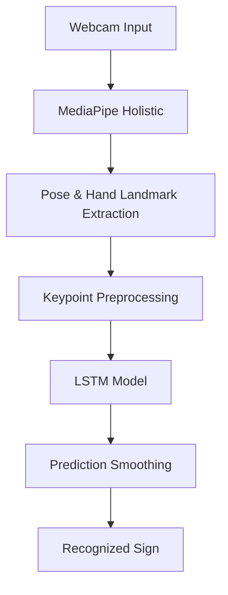

# 🤟 AI Sign Language Translator using LSTM


A real-time Sign Language Recognition system built using **PyTorch**, **MediaPipe Holistic**, **OpenCV**, and **Long Short-Term Memory (LSTM)** networks. The system captures human pose and hand landmarks from a webcam, processes them into temporal sequences, and predicts predefined sign language gestures in real time.

---

# 📸 Project Preview

## Real-Time Demo


## Prediction Example


---

# ✨ Features

- 🎥 Real-time webcam-based sign language recognition
- 🖐️ MediaPipe Holistic pose and hand landmark detection
- 🧠 LSTM-based temporal sequence classification
- 📊 Confidence-based prediction smoothing
- ⚡ Fast real-time inference
- 🛠️ Modular and easy-to-extend project architecture
- 📦 Pre-trained model checkpoint included

---

# 🧠 Recognized Signs

The current version supports recognition of:

- 👋 Hello
- 😊 How Are You
- 🙏 Thank You

---

# 🛠️ Technology Stack

| Category | Technology |
|-----------|------------|
| Programming Language | Python |
| Deep Learning | PyTorch |
| Computer Vision | OpenCV |
| Landmark Detection | MediaPipe Holistic |
| Numerical Computing | NumPy |
| Machine Learning Model | LSTM (Long Short-Term Memory) |

---

# 🔄 Project Workflow



---

# 📂 Project Structure

```text
sign-language-translator-lstm/
│
├── assets/
├── checkpoints/
│   └── best_model.pth
├── data/
│   ├── keypoints/
│   ├── labels.csv
│   └── keypoint_dataset.py
├── models/
│   └── pose_lstm.py
├── static/
├── templates/
├── utils/
│   └── preprocess_keypoints.py
│
├── app.py
├── inference_engine.py
├── infer_realtime.py
├── record_sign.py
├── train_lstm.py
│
├── requirements.txt
├── README.md
├── LICENSE
└── .gitignore
```

---

# ⚙️ Installation

Clone the repository:

```bash
git clone https://github.com/indrajithberlin/sign-language-translator-lstm.git
```

Navigate to the project directory:

```bash
cd sign-language-translator-lstm
```

Install the required dependencies:

```bash
pip install -r requirements.txt
```

---

# ▶️ Usage

Run the real-time inference script:

```bash
python run_demo.py --checkpoint checkpoints/best_model.pth
```

Press **Q** to quit the application.

---

# 🏗️ How It Works

1. Capture live webcam frames.
2. Detect pose and hand landmarks using MediaPipe Holistic.
3. Extract landmark coordinates and preprocess them.
4. Construct temporal keypoint sequences.
5. Feed sequences into the trained LSTM model.
6. Apply confidence-based smoothing.
7. Display the recognized sign in real time.

---

# 🚀 Future Improvements

- Expand the supported sign vocabulary.
- Improve model robustness with larger datasets.
- Support sentence-level sign recognition.
- Add multilingual support.
- Complete and integrate the web-based interface.
- Optimize the model for deployment on edge devices.

---

# 👨‍💻 Author

**Indrajith Berlin**

B.Tech Computer Science & Engineering (AI & ML)

- LinkedIn: www.linkedin.com/in/indrajith-berlin

- GitHub: https://github.com/indrajithberlin

---

# 🤝 Contributing

Contributions, suggestions, and improvements are welcome. Feel free to fork the repository and submit a pull request.

---

# 📄 License

This project is licensed under the MIT License.
